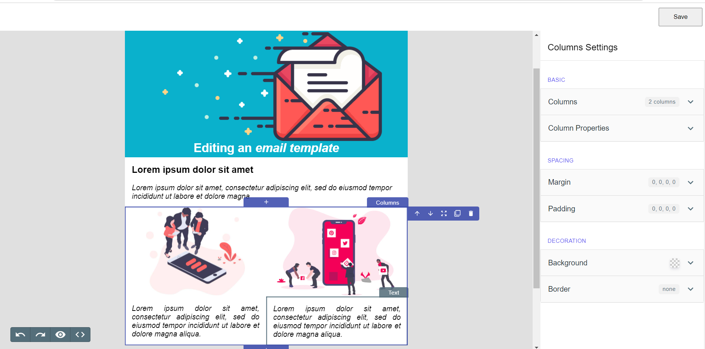

# Email-Editor

A lightweight email editor to embed in your SaaS application. It is built on [craft.js](https://craft.js.org/) that provides a drag-n-drop system and handles the way user components should be rendered, updated, and moved. It is entirely server-side rendered, improving user experience.



## Usage

To use our React Email Editor, install it from NPM and include it in your own React build process.

```
npm i raven-react-email-editor
```

Checkout the example usage here - https://github.com/ravenappdev/react-email-editor

## Live Demo

Checkout the demo app here - https://email-editor-demo-blue.vercel.app/

## Documentation

-   [Run Locally](https://prachi-choudhary.gitbook.io/email-editor-1/)
-   [Customization](https://prachi-choudhary.gitbook.io/email-editor-1/)

## License

MIT Licensed
